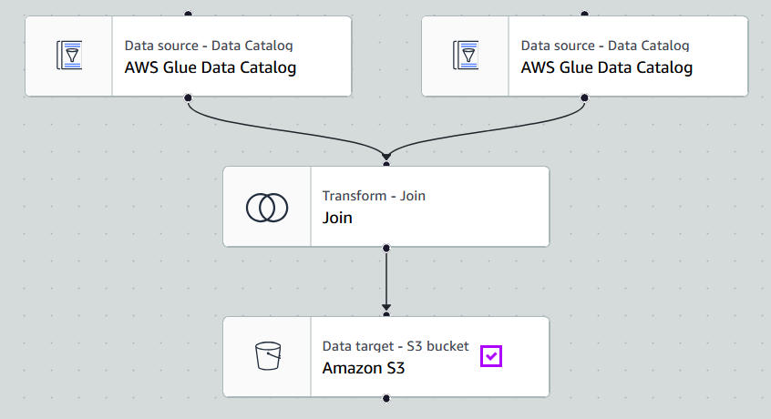

# 📺 YouTube Trending Data Analytics on AWS

## 🧠 Overview  
This project focuses on ingesting, transforming, and analyzing structured (CSV) and semi-structured (JSON) YouTube trending video data across multiple regions. The primary goal is to automate a cloud-based ETL pipeline using AWS services for scalable data engineering and business insights.

---

## 🎯 Project Goals

- **🔁 Data Ingestion**: Automate ingestion of CSV and JSON data from local to S3 using AWS CLI.
- **⚙️ ETL System**: Transform raw statistics and reference metadata using AWS Glue and Lambda.
- **💧 Data Lake**: Store raw and cleansed data in an organized, queryable format in Amazon S3.
- **📈 Scalability**: Design for scale using serverless architecture to accommodate dynamic data loads.
- **☁️ Cloud-Native Design**: Use AWS-native services for seamless integration, scalability, and management.
- **📊 Reporting**: Enable business intelligence via AWS Athena and QuickSight dashboards.

---

## 🧰 AWS Services Used

| Service       | Purpose                                                                 |
|---------------|-------------------------------------------------------------------------|
| **Amazon S3**     | Data lake to store raw, cleansed, and analytics data                      |
| **AWS IAM**       | Access and role management for secure and granular service permissions    |
| **AWS CLI**       | Upload data to S3 with Hive-style partitioning (by region)               |
| **AWS Glue**      | Serverless ETL: Crawlers, Jobs, and Studio used for transformation        |
| **AWS Lambda**    | On-the-fly JSON transformation triggered by S3 events                    |
| **AWS Athena**    | Serverless querying of both raw and enriched datasets                    |
| **Amazon QuickSight** | Visualization and dashboarding on final analytics data                       |

---

## 📦 Dataset Used

- **Source**: [Kaggle - Trending YouTube Video Statistics](https://www.kaggle.com/datasets/datasnaek/youtube-new)  
- **Description**: Includes daily trending YouTube videos per country, with CSVs for statistics and JSONs for category metadata.  
- **Fields**: `video_id`, `title`, `views`, `likes`, `dislikes`, `comments`, `tags`, `publish_time`, `category_id`, `region`, etc.

---

## 🏗️ Architecture Overview

```
Kaggle Data → S3 (Landing Bucket)
        → AWS Glue Crawlers → Glue Catalog Tables
        → AWS Lambda (Trigger on JSON) → S3 (Cleansed Bucket)
        → AWS Glue Jobs (ETL for CSV) → S3 (Cleansed Bucket)
        → AWS Glue Studio (Join JSON + CSV) → S3 (Analytics Bucket)
        → Athena + QuickSight Dashboards
```

---

## 🔄 Detailed Project Flow

1. **Ingest Raw Data to S3**  
   - Upload CSVs to:  
     `s3://<bucket-name>/youtube/raw_statistics/region=XX/`  
   - Upload JSONs to:  
     `s3://<bucket-name>/youtube/raw_statistics_reference_data/`

2. **Catalog Raw Data**  
   - Use AWS Glue Crawlers to scan the raw CSV and JSON directories and register them in the Glue Data Catalog.

3. **Preprocess JSON via Lambda**  
   - Lambda function is triggered by S3 PUT events for JSON files.  
   - It extracts nested `items` and writes to S3 in Parquet format.

4. **ETL on CSV via Glue Job (PySpark)**  
   - Filter using `predicate_pushdown` for regions.
   - Apply schema mapping, clean nulls, and partition output by `region`.

5. **Catalog Cleansed Data**  
   - Crawl the cleaned S3 data to update the Glue Catalog.

6. **Athena Queries for Analysis**  
   - Join `raw_statistics` with `cleaned_statistics_reference_data` on `category_id = id`.

7. **Build ETL Join in Glue Studio**  
   - Use `Inner Join` node to merge CSV and JSON sources.
   - Output partitioned analytics data to `s3://<analytics-bucket>/`.
   


8. **Visualize with QuickSight**  
   - Connect to Athena → analytics table.
   - Create region-wise and category-wise trend dashboards.

---

## 📊 Visual Output

Use Amazon QuickSight to create dashboards such as:
- Most viewed videos by region
- Category-wise average likes/dislikes
- Trends over time in publishing behavior
